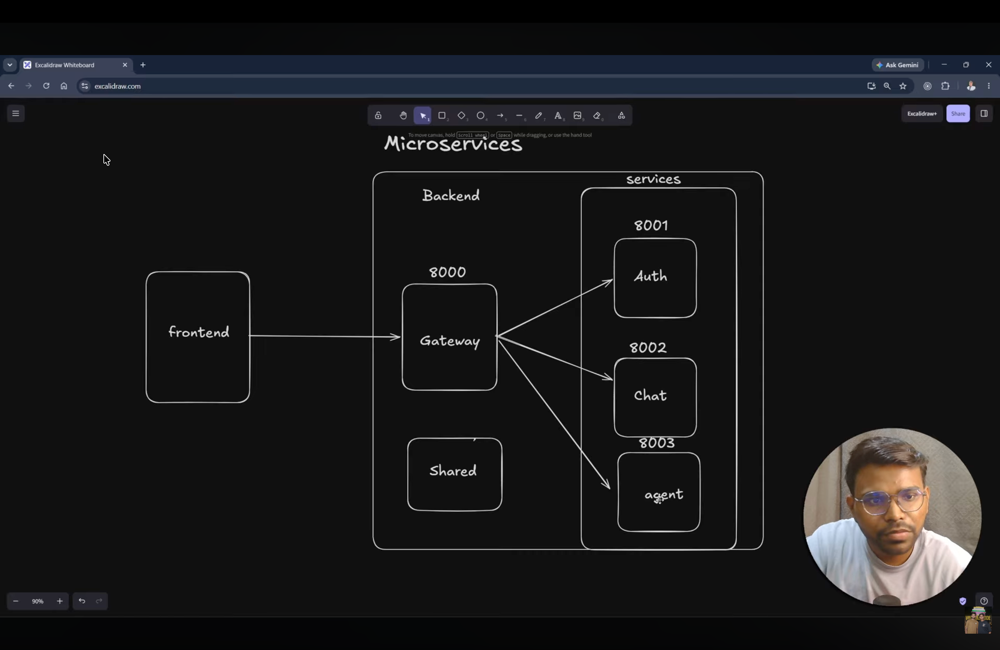

PHASE ===>  STARTED

first we have created backend and frontend folder 
and in this project we are going to use the architecture is microservices which we have for every services we have different server for it
and then we have created services and gateway folder in backend folder 
draw the diagram of microservices 

and then we have created a shared folder

then in gateway we install npm init -y,express,dotenv,morgan
from now we are going to work in gateway folder only
we have made a index.js file ,.env in it
in index.js we have import express,.env and then config it 
and then we have a variable port for storing port
and store the port in .env file
and then we have made an instance for express
and at last server ko listen kara denje with a callback 
and then we have made a simple route "/" and get a response
now we have to bring the database in it

now we will shifted to services folder and create a auth folder
then in auth  we install npm init -y,mongoose,express,dotenv
we have made a index.js file ,.env in it
in index.js we have import express,.env and then config it 
and then we have a variable port for storing port 
and store the port in .env file and and add mongodb_url for auth only collection
and then we have made an instance for express
and at last server ko listen kara denje with a callback 
and then we have made a simple route "/" and get a response 

and no we have to connect database for that we will made a folder config and in it made a db.js file 
import mongoose in it and make async function connnectdb using try-catch and then using connect function 
and then export it 
and then called db.js in index.js of services

now we have to connect the gateway to the auth services 

so now in gateway folder and install packages 
now we will add a middleware-use proxy in it ,so when fetch 8000 it will run and so when somebody has /auth in their
URL so we will navigate them to auth services 
so add a auth service url in dotenv file 

NOW WE ARE STARTING THE COPLETE AUTHENTICATION PROCESS
for that we have made a model folder in auth folder and a user.model.js file in it for the user only
so we have to make schema using mongoose which have all info/blueprint of user 
we are using firebase for authemtication
and them after making schema we are making model and then exporting it

so for authentication,after looging in with google firebase will verifies the user
whether to create new user or already exist data for already exist user to give
so for that we will make a file in config firebase.js
and install a package called firebase-admin
and now log in firebase create new project 
and they will give you some secret keya nd code thay you have to copy in our firebase.js and it is configure 
now create a controller and routes folder in auth folder
and now in controller folddr create a auth.controller.js file
and then we make login controller

NOW WE ARE SHIFTING TO FRONTEND FOLDER TO KNOW HOW REALLY OUR LOGIN BUTTON WE GOING TO WORK 
SO AFTER CLICKING BUTTON WE CAN AUTHENTICATE WITH GOOGLE 
THEN WE WILL KNOW HOW GGOGLE WILL PROVIDE US WITH DATA IN FRONTEND AND FROM THAT
WE WILL COLLECT SOME SOME TOKEN FROM THEM AND GIVE IT TO LOGIN CONTROLLER

in frontend install vite@ latest and also Tailwind CSS packages. The frontend app uses `tailwindcss`, `postcss`, and `autoprefixer` so Tailwind classes render correctly in `frontend/vite-project/package.json`.
we are going to create button in app.jsx
now by clicking on this biutton we have authenticated using google
so we have to add firebase in your frontend
so we will make a new folder called utils and make a firebase.js in it
then we will install firebase and mport the code of it in firebse.js
and then we create a .env file for stroing the api key of firebase in it
now we will bring a an authentication and googleauthprovider and then export them 

and now in firebase we have to unable 
and now we have do when button is click google se authenticaton ho 

in app.jsx create a synce function googlelogin and give auth and provider to it and give onclick to button
now we will able to click on it and authemticated the google and the respond given by google has a uid(uniqueid) which we have 
store in backend and we will use it to verify whether the user is there or not 
and controller likenge aur phie  api banakar uske andar ise function ke andar fetch kar denje aur token bhej denje

so now will shift to backend=>
auth.controller.js ke andar token leke aana hai frontend se
and to bring req.body we will middleware in index.js 
ab jo token aaya hai usko verify karenge aur data leke aayenge
so we will import getauth and app from firebase and config/firebase.js
aur phir ham use verify kar denje with decoded function
ab hame decoded se sara data jo frontend me hai vo mil jayega aur jo usme uid hai vo extract karrni hai 
aur ckeck karna hai ki database mei jo firebase uid hai jo hame is data se mili hai toh toh hum response return kar denje aur nahi toh
naya user ko create karna padega 
hame user ka model leke aana hai,phir hum user ko import from user.model.js 
now we will find it on the basic of firebaseuid from usermodel.js by the help of uid of the user of their google authentication

even we have see this sometime that when we come to a website we see we are already login because it might be possible that we have login 2-4 days ago so we dont have to login again 
toh hum kya karte hai ki ek session id ko cookies mei store karate hai aur agar 7 din bad vo expired ho gayagi toh phir sse login karna 

phir routes folder mei jaake auth.routes.js file banayenge aur usme route banayenge aur controller ko import karenge aur route ke ander controller ko call kar denge aur index.js mei router ko import karenge aur use kar denge

aur ab hame is login wali api ko frontend mei fetch karna hai
ab frontend ki .env file mei gateway ka url store karenge aur axios packages install apis ko fetch karenge frontend mei
ab axios.js file banayenge utils folder mei aur usme axios ka instance banayenge aur export karenge

phir app.jsx mei import karenge aur handlelogin function banayenge aur usme axios ka instance use karenge aur login api ko call karenge aur token bhej denge aur response ko console mei log kar denge

now we import {initialapp,cert} and serviceaccount from "firebase-admin/app and ../serviceaccountkey.json respectively from firebase.js and then we will initialize the app with the help of serviceaccount and cert

phir backend ki .env mei frontend ka url store karenge taki backend se frontend ko access kar sake aur phir auth.controller.js mei login function ke ander response return karenge aur frontend ko bhej denge

phir hum cors and cookiee-parser packages install karenge aur index.js mei import karenge aur use karenge taki frontend se backend ko access kar sake aur cookie ko parse kar sake

aur phir auth.controller.js mei login function ke ander cookie set karenge aur frontend ko bhej denge taki frontend mei cookie store ho sake aur agar user 7 din tak login rahe toh cookie expire na ho

aaje humne backend ke auth.controller.js mei login function ke ander user ko bhi response mei bhej denge taki frontend mei user ka data mile aur uske hisab se frontend ko render kar sake

phir hamne import kiya hai crypto from "crypto" taki hum user ke liye unique session id generate kar sake aur usko cookie mei store kar sake taki user 7 din tak login rahe aur cookie expire na ho

aur phir humne import kiya hai {createconnection} from "mongoose" taki hum database se connection create kar sake aur user ke liye unique session id generate kar sake aur usko cookie mei store kar sake taki user 7 din tak login rahe aur cookie expire na ho    

import {getAuth} from "firebase-admin/auth" taki hum firebase ke auth se user ko verify kar sake aur uske data ko extract kar sake taki user ke liye unique session id generate kar sake aur usko cookie mei store kar sake taki user 7 din tak login rahe aur cookie expire na ho

import {app} from "../config/firebase.js" taki hum firebase ke app ko use kar sake aur uske auth se user ko verify kar sake aur uske data ko extract kar sake taki user ke liye unique session id generate kar sake aur usko cookie mei store kar sake taki user 7 din tak login rahe aur cookie expire na ho

aur phir humne start kiye saare server aur successfully run ho gaya server aur button click karke login bhi ho gaya aur saara data bhi mil gaya aur cookie bhi set ho gayi aur 7 din tak login rahega user aur cookie expire nahi hogi aur moongose mei bhi store ho gata data

ab ham cookie ke saath saath redis ka use karenge

jo auth.controller hai usme jo seesion hai use ham redis ke andar rakhenge aur jis time ham logout karenge session bhi delete kar denje redis mei se aur cookie bhi hata denje toh phir hum redis mei data rakh lenge

ab redis ko install kerenge with the use of docker compose file in our backend and usme sab chiz fulfill karte 
ab ham docker compose up karke install karenge jisse jamre docker dekstop par ek container ban jayega backend karke. and we able to use redis par usse pahle backend me npm init install kar ke npm instal ioredis install karenge jisse ham shared folder mei use kar sake

ab shared folder mei redis folder mei redis.js banaker ioredis ko import karenge and gateway ki .env mei redis_url use karenge
phir ham redis to gatway se coonect kar denje aur export kar denje then services mei auth folder ki .env mei redis url use kar lenge

ab auth.controller.js mei redis ko use karenge aur sessionid me set karenge

note: gateway bhi redis par depend karta hai. `backend/gateway/middlewares/auth.middleware.js` validates the `session` cookie on every protected request by reading session data from Redis, so Redis must be available for both auth service and gateway session validation.

toh humne kya kiya hau ki agar user login hoga redis ke andar set kar denje aur jab logout karenge toh sessionid delete hogayegi 
ab frontend ka ui banane wale hai aur button mei react icon se google ka icon import karange aur react-icon install karenge
aur vo button me onclick laga kar on kar denje 

ab refresh ke baad redis se data leke aayenge current user find karna hai userget karna hai uske liye api banate hai 
basically hame ek api chaiye ki jo user currently login hai uska data find out ho gaye aur jab bhi refresh kare utnibaar api data lake de

uske liye seesion find karke uska data lake isko dena hai
go in gateway to make the middlewares for it SO MAKE A middlware folder and auth.middleware.js file
ROUTES => MIDDLEWARE => CONTROLLER

cookies ke andar se sessionid leke aani hai ab use controller mei lagani hai toh gateway ke andar controller folder ,use.contoller.js file
ab imddleware se sab export karake index.js me routes banakr aur controller me response karna hai
aur uske baad frontend me data fetch karna hai toh ham freatures folder banayenge jisme saare api issi mei hi fetch kar lenge

phir frontend me getcurrentuser.js me routes ko lakar humne authentication wala complete kar diya hai

AB HUM REDUX TOOLKIT USE KARENGE

ab jo data hame mila hai use hum kahi pe store kara lenge jisse frontend mei use kar pyae toh ham redux toolkit use karegenge state managment kar ne liye  ki hum will make lot of files toh we have access all of them so for that we will make a store in which we put all the data and whenever we need it we can directly take data from that store so install reacttoolkit and react-redux in it

make a redux folder and store.js ,userslice.js jisme user  ka data hoga aur 

---

MISSING BUT IMPORTANT STEPS AND PACKAGES

1. Packages installed in each folder (not fully described before):
   - `backend/`: `ioredis` for Redis client.
   - `backend/gateway/`: `express`, `dotenv`, `cors`, `cookie-parser`, `express-http-proxy`, `morgan`.
   - `backend/services/auth/`: `express`, `dotenv`, `mongoose`, `firebase`, `firebase-admin`.
   - `frontend/vite-project/`: `axios`, `firebase`, `@reduxjs/toolkit`, `react-redux`, `react-icons`, `react`, `react-dom`, `vite`, `eslint`, `@vitejs/plugin-react`, `tailwindcss`, `postcss`, `autoprefixer`.

   Note: `backend/gateway/package.json` currently includes `@reduxjs/toolkit` and `react-redux`, but those are frontend state management libraries and do not belong in the backend proxy gateway.

2. Important imports and exports actually used in code:
   - `gateway/index.js` imports `protect` from `./middlewares/auth.middleware.js` and `getCurrentuser` from `./controllers/user.controller.js`.
   - `auth/controller/auth.controller.js` imports `getAuth` from `firebase-admin/auth`, `app` from `../config/firebase.js`, `User` from `../models/user.model.js`, `crypto` from `crypto`, and `redis` from `../../../shared/redis/redis.js`.
   - `auth/routes/auth.routes.js` imports `login` and `logout` from `../controller/auth.controller.js`.
   - `frontend/vite-project/src/App.jsx` imports `getcurrentuser` from `./features/getcurrentuser.js`, `useDispatch` from `react-redux`, and `setUserdata` from `./redux/userslice.js`.
   - `frontend/vite-project/src/main.jsx` imports `Provider` from `react-redux` and `store` from `./redux/store.js`.
   - `frontend/vite-project/src/features/getcurrentuser.js` imports `api` from `../../utils/axios`.
   - `frontend/vite-project/utils/firebase.js` imports `initializeApp` from `firebase/app` and `getAuth`, `GoogleAuthProvider` from `firebase/auth`.

3. Environment variables and config values used:
   - `gateway/.env`: `PORT`, `FRONTEND_URL`, `AUTH_SERVICE`, `REDIS_URL`.
   - `services/auth/.env`: `PORT`, `MONGODB_URL` (or `MONGO_URI`) for MongoDB.
   - `frontend/vite-project/.env`: `VITE_SERVER_URL`, `VITE_FIREBASE_API_KEY`.
   - `backend/services/auth/config/firebase.js` uses `serviceAccountKey.json` with `firebase-admin/app` to initialize Firebase Admin.

4. Important middleware and wiring steps:
   - `gateway` uses `app.use(cors({ origin: process.env.FRONTEND_URL, credentials: true }))` and `app.use(cookieParser())` so cookies from the frontend can be read.
   - `gateway` proxies `/auth` requests to the auth service using `express-http-proxy`.
   - `gateway` exposes `/me` and protects it with `auth.middleware.js` by reading the `session` cookie and loading Redis session data.
   - `services/auth/index.js` uses `app.use(express.json())` so login requests with JSON body are parsed.
   - `auth.controller.js` sets a session cookie with `res.cookie('session', sessionid, { httpOnly: true, secure: false, sameSite: 'strict', maxAge: 24*60*60*1000*7 })`.
   - `shared/redis/redis.js` creates a Redis client using `ioredis` and connects to `process.env.REDIS_URL`.

5. Frontend state flow you completed but did not fully describe:
   - `App.jsx` calls `getcurrentuser()` in `useEffect`, then dispatches the returned user data into Redux using `setUserdata`.
   - `src/redux/store.js` configures the Redux store with `userslice`.
   - `main.jsx` wraps `<App />` in `<Provider store={store}>` so the store is available in the app.

6. Docker / Redis step that is important:
   - `docker-compose.yml` is used to run Redis as a container, and gateway/auth service share the same Redis instance through `REDIS_URL`.
   - If Redis is not running or `REDIS_URL` is wrong, session lookup in the gateway will fail and `/me` will return 500.

7. Notes about missing frontend packages from current code:
   - Your README mentions Tailwind, but the current `package.json` does not include Tailwind packages. If you want Tailwind styling, install it explicitly.
   - The current frontend code already uses `react-redux` and `@reduxjs/toolkit`, so that setup is real and should be documented.

Additional implementation details to keep in the README:

- A root `backend/package.json` exists and manages root-level backend dependencies. It includes `ioredis` and `init` for the backend environment.
- `backend/docker-compose.yml` starts a Redis service on port `6379:6379` so both gateway and services can share the Redis instance.
- `backend/shared/redis/redis.js` connects to Redis using `process.env.REDIS_URL` and logs successful connection status with `redis.on("connect", ...)`.
- In `backend/gateway/index.js`, the gateway initializes `cookieParser()` and sets `cors` with `credentials: true`, which is necessary for browser session cookies to be sent through the proxy.
- The gateway uses `proxyWithHeader()` and `express-http-proxy` to decorate proxied requests. When a session is authenticated, it adds the authenticated `userid` to proxied requests as `x-user-id`.
- The gateway also serves `GET /me` locally using `backend/gateway/controllers/user.controller.js`, returning the parsed `req.user` from the auth middleware.
- The backend storage is separated across auth, chat, and agent services, with each service using its own MongoDB settings in `.env`.
- The auth user schema stores `firebaseUid`, `name`, `email`, and `avatar`, and uses Mongoose `timestamps` to record creation/update times.
- The chat conversation schema stores `title` (default `New Chat`), `userId`, and `timestamps`.
- The chat message schema stores `conversationId` as an ObjectId reference to `Conversation`, `role` as an enum of `user` or `assistant`, `content` as a string, and `timestamps`.
- Auth sessions are stored in Redis under keys like `session-${sessionid}` and carry `{ userid, name, email, avatar }`. The session expires in 7 days.
- The auth cookie is named `session` and is sent to the browser with `httpOnly: true`, `secure: false`, `sameSite: 'strict'`, and `maxAge: 24*60*60*1000*7`.
- `backend/services/auth/config/firebase.js` initializes Firebase Admin with `serviceAccountKey.json` imported using `with { type: "json" }`.
- The LangGraph agent router prompt in `backend/services/agent/graph/router.js` defines rules for `chat`, `search`, `coding`, `pdf`, `ppt`, and `vision` before selecting the correct agent.
- The agent workflow in `backend/services/agent/graph/graph.js` is configured as:
  - `__start__` -> `router`
  - `router` conditionally -> `chat`, `search`, `coding`, `pdf`, `ppt`, or `vision`
  - `search` -> `chat`
  - all other nodes -> `_end_`
- `backend/services/agent/config/llmmodel.js` maps `chat`/`search` to Groq `openai/gpt-oss-120b` and `coding` to Google Gemini `gemini-2.5-flash`.
- `backend/services/agent/controller/agent.controller.js` forwards the user message to the chat service save-message endpoint before invoking the agent graph.
- The frontend uses `import.meta.env.VITE_SERVER_URL` for gateway requests and `VITE_FIREBASE_API_KEY` for Firebase login popup actions.
- `frontend/vite-project/src/utils/axios.js` creates an Axios client with `baseURL: import.meta.env.VITE_SERVER_URL` and `withCredentials: true` so cookies are included automatically.
- `frontend/vite-project/src/redux/store.js` combines the `user` and `conversation` reducers.
- `frontend/vite-project/src/redux/conversationslice.js` uses `unshift()` to insert new conversations at the start of the list.
- `frontend/vite-project/src/App.jsx` calls `getcurrentuser()` in `useEffect()` and populates Redux state on refresh when the session cookie is valid.
- `frontend/vite-project/src/components/sidebar.jsx` tracks `imageError` and renders a placeholder user icon if the Google avatar fails to load.

These details should be documented so the README matches the actual implemented architecture.

PHASE-1 ===> COMPLETED

PHASE-2 ===> STARTED

CREATING AND STARTING OF MAKING CHAT SERVICE AS OUR AUTH SERVICE IS DONE

ow we will shifted to services folder and create a chat folder
then in auth  we install npm init -y,mongoose,express,dotenv
we have made a index.js file ,.env in it
in index.js we have import express,.env and then config it 
and then we have a variable port for storing port 
and store the port in .env file and and add mongodb_url for auth only collection
and then we have made an instance for express
and at last server ko listen kara denje with a callback 
and then we have made a simple route "/" and get a response 

and no we have to connect database for that we will made a folder config and in it made a db.js file 
import mongoose in it and make async function connnectdb using try-catch and then using connect function 
and then export it 
and then called db.js in index.js of services

then we will makea model folder and a file in it called message.model.js and then make the schema for it and a conversation.model.js 
in conversation there are so many message ab now make controller folder to make conversation and saved message in it and make a chat.controller.js for it

now we want a userid so for that we will make a header to send the userid when we direct to chat routes/services
header ke liye gateway mei utils folder me proxywithheader banakar aur iske andar header ka function banakar aur kis services ko header dena hai vo batana hai

ab sari api chat.controller mei banakr hum jo usme updateconversation wali api usme jab bhi nayi convo chalu karte hai toh monogodb ek nayi uniqueid banata hai vo hame lani hai ya banani hai 
ab inke routes banayenge export kar denje aur hamri chat services ban gayi

=====>>   abhi hum agent service banayenge

now we will shifted to services folder and create a agent folder
then in auth  we install npm init -y,mongoose,express,dotenv
we have made a index.js file ,.env in it
in index.js we have import express,.env and then config it 
and then we have a variable port for storing port 
and store the port in .env file and and add mongodb_url for auth only collection
and then we have made an instance for express
and at last server ko listen kara denje with a callback 
and then we have made a simple route "/" and get a response 

and no we have to connect database for that we will made a folder config and in it made a db.js file 
import mongoose in it and make async function connnectdb using try-catch and then using connect function 
and then export it 
and then called db.js in index.js of services

now we have to connect the gateway to the auth services 

so now in gateway folder and install packages 
now we will add a middleware-use proxy in it ,so when fetch 8000 it will run and so when somebody has /agent in their
URL so we will navigate them to agent services 
so add a auth service url in dotenv file 

===>>> BEST GITHUB REMEMBER <<<===

YES SO FIRST MAKE COMMEMT THAT I AM STARTING TO  WORKING ON 509 ISSUE AND THEN PUSH THIS IN GITUB AND THEN DO PULL REQUEST AND AGAIN DO COMMENT WHAT WE HAVE CHANGED OR UPDATED BUT FIRST TEST ALL THE TEST CASES AND THEN GO TO THE WEBSITE AND CHECK DOES THAT CHANGED HAS IMPLETED IN IT AND ALSO CHECK THAT DUE TO THIS CHANGED DOES AN OTHERIS ERROR.ISSUE STARTED/EXISTED OR NOT IF YES THEN SOLVE THAT ALSO

===>>> BEST GITHUB REMEMBER <<<===

now create a graph folder in agent and a state.js file in it which has a state(like promopt etc) which it provided to all the agent to access it and add a agent state which tell which agent is used

to we install npm install @langchain/langgraph @langchain/core and then make all the nodes that we have lets start with router.js and then make a agents folder for that and create all agent file and connect all the nodes using edge by langgraph so make a graph.js and in that when we are making conditionedge first router will come and in that we will defie a state in which we will tell on what basis we will decide which agent to use

now compile whole workflow to use and now we start making the router.js and then make every agent that how they are  going to work and all

now we are going to use an agent in router agent to guide whether on the basis of prompt which agent we are going to use (like,chat,ppt,image etc.) and after that we will use different different ai agent(like grok,deepseek,gemini etx) in differnt node for making our task done so for that we are making a utils folder and make a llmmodel.js file which will tell us that  eg- like if we are using chat agent so use grok model,for coding agent use deepseek model.  

first we make a chat agent with the help of grok  and for search agent used grok and for coding agent is gemini 

now we are making the router agent in graph folder and add llm in it so that it can know in which agent prompt has to sent

now we are making chat agent in agent folder and add llm and for  node give a state  

now will we make a controller agent folder ke andar ko frontend se fetch karyenge kuch bhi like ai se response lene ke liye 

we have make a function that stored the message given by agent but we havn't stored the message that the user has asked toh ham agent wale controller me saved message ko call karenge and aur ham save karenge aur database mei message bhi saved ho gayega 

toh frontend ki api ko call karne le liye hum axios ko install karenge agent.controller.js mei sab chizo banake route bana denje

abhi ham frontend banayenge jisse ham chat kar paaye meesage likh paye input area aur sab

now we will make chatarea,sidebar,artifate area in frontend,first we will make sidebar so install "lucide-react" that help us to make a built-in icon function in it and now we will make a files in features folder called createconversation.js and getcoversation.js to     create and get coversation.  

and now get like user we have a redux file in which we kept all data of user and updated it time to time just like that we will make a redux file for conversation which stored and  updated all the  completed chat that we made time to time as user add more message or chat in

ab hume inhe fetch karayenge sidebar mei. frontend mei.pehle humne newchat ka button create karkr usko responsive kiya ki agar refresh karne ke baad automatic nayi chat aa aajaye aur newchat ka button click karke bhi nayi chat ban gaye

ab coversation matlab chat history wala div banayenge aur agar chat mei kuch bhi nahi hai toh vo hum nahi dikhayenge aur uske bottom mei user ka avatar,name and logout option dalna hai also ek icon credit(plan) wala 

ab logout button ko responsive banate hai ki click krne ab logout ho gaye feature me logout.js file bana kar

ab ab hame chat area banayenge jisme user ka message aur agent ka message dono dikhaye jaaye aur user ka message right side aur agent ka message left side dikhaye jaaye aur user ke message ke niche time bhi dikhaye jaaye aur agent ke message ke niche time bhi dikhaye jaaye

ab hame input area banayenge jisme user ka message likh sake aur send kar sake aur send karne ke baad message chat area mei dikhaye jaaye aur agent ka response bhi dikhaye jaaye is liye ham messagelist.jsx file banayrnge agar kuch bhi nahi hai toh cortexai ka logo and recommendationbhi dalenge  and navbar.jsx and chatinput.jsx file banayenge aur input area ke niche send button bhi dikhaye jaaye aur send karne ke baad message chat area mei dikhaye jaaye aur agent ka response bhi dikhaye jaaye

navbar.jsx mei konsi conversation chalu hai aur icon dikhega uske baad conversation likhi hogi,aur phir dikhrge hamne kitne messages conversation mei hai aur ham phir state ko fetch karayenge aur jo chat selected hai vo dikhayenge

now we will make a div in which we will show how many messages are this in this conversation toh ham messages ko getmesssage api ko called karenyenge toh features folder mei getmessages.js file banayenge

ab in messages ko get karva ne baad hame unko redux mei messagesslice.js store karna hai jisse hame pata chale ki kitne messages hai aur kaunse message kaunse conversation mei hai toh ham redux folder mei messageslice.js file banayenge aur usme state banayenge aur uske ander messages ko store karenge aur update karenge aur call kar lenge chatarea ke andar

ab navbar ke anandar hame ye dikhana hai ki kitne messages hai toh ham getmessages api ko call karenge toh unki length batani hai
toh hame navbar.jsx ke anadr messsages ko get kar lenge ab css denje

if we dont haave any conversation the we will not the navbar only the chat area will be there and if we have any conversation then we will show the navbar and chat area both
 
abh ham messagelist wala part banayenge jisme hame user ka message aur agent ka message dono dikhaye jaaye aur user ka message right side aur agent ka message left side dikhaye jaaye aur user ke message ke niche time bhi dikhaye jaaye aur agent ke message ke niche time bhi dikhaye jaaye

 even though we do not have any conversation or length of message ==0 then we will show the cortexai logo and recommendation in the chat area and if we have any conversation then we will show the messages in the chat area aur phir ,essahes ko map kara denje

 ab ham messagebubble.jsx file banayenge jisme user ka message aur agent ka message dono dikhaye jaaye aur user ka message right side aur agent ka message left side dikhaye jaaye aur user ke message ke niche time bhi dikhaye jaaye aur agent ke message ke niche time bhi dikhaye jaaye aur role bhi alot kar denje

 ab ham chatinput.jsx file banayenge jisme user ka message likh sake aur send kar sake aur send karne ke baad message chat area mei dikhaye jaaye aur agent ka response bhi dikhaye jaaye ab ek attachment icon aur mic icon banayenge and send ka button bhi banaynege

 ab ham chatagent ke liye agent.controller.js mei ek api banayenge jisme user ka message aur conversationid bhejenge aur agent ka response milega aur uske baad hame uska message bhi save karna hai toh ham chat.controller.js mei save message api ko call karenge aur uske baad hame agent ka response milega toh usko bhi save kar denge aur phir frontend mei dikhaye jaaye

 ab ham features folder mei sendmessage.js file banayenge jisme ham agent.route.js se/chat wali api layenge phir sendmessage ko chatinput mei layenge  ab hum handleendmessage api mei data fetch karenge aur await lagayege aur sendmessage ko call karayenge ab hume kya kya usme bhejna hai payload variable mei daalenge jaise ki prompt,conversationid jo selected wali hai ab hame ai wali message ko bhi save karna hai  

 ab dikhat yeh hai ki hamne koi convesation selected hi nahi kiya tha toh hame aisa chaiye kki automatically nayi conversation create ho gaye aur usme message save ho jaaye aur agent ka response bhi save ho jaaye aur jo messagebubble hai use abhi ham banayenge ab hame messagebubble.jsx file banayenge jisme user ka message aur agent ka message dono dikhaye jaaye aur user ka message right side aur agent ka message left side dikhaye jaaye aur user ke message ke niche time bhi dikhaye jaaye aur agent ke message ke niche time bhi dikhaye jaaye aur role bhi alot kar denje
 
 ab ham react markdown packages install karenge jisse hamne agent ka response ko markdown mei dikhaye jaaye aur ab hamne react markdown packages install karenge jisse hamne agent ka response ko markdown mei dikhaye jaaye aur code block bhi dikhaye jaaye aur code block ke liye syntax highlighting bhi ho jaaye aur code block ke liye copy button bhi ho jaaye aur code block ke liye line number bhi ho jaaye aur code block ke liye language bhi dikhaye jaaye aur code block ke liye theme bhi change ho jaaye aur code block ke liye dark mode bhi ho jaaye aur code block ke liye light mode bhi ho jaaye aur code block ke liye auto scroll bhi ho jaaye aur code block ke liye auto wrap bhi ho jaaye aur code block ke liye auto format bhi ho jaaye aur code block ke liye auto indent bhi ho jaaye aur code block ke liye auto lint bhi ho jaaye aur code block ke liye auto fix also ho jaaye

 

 

